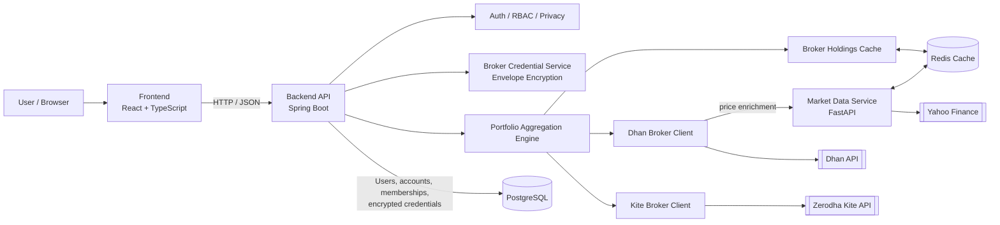

# BrokerHub

BrokerHub is a multi-account investment aggregation platform for collaborative portfolio visibility across members in a shared account context.

It combines account-scoped RBAC, privacy-aware aggregation, encrypted broker credential storage, and microservice-based market enrichment in an architecture designed to support additional brokers and user groups.

## Overview

BrokerHub supports portfolio collaboration where users need:

- A unified view across multiple broker connections
- Access boundaries per account membership
- Practical privacy controls between account members
- Encrypted handling of broker credentials
- Reliable aggregation that degrades gracefully under partial broker/API failures

## Key Features

| Area                            | Capability                                      | Implementation Highlights                                                                                                             |
| ------------------------------- | ----------------------------------------------- | ------------------------------------------------------------------------------------------------------------------------------------- |
| Identity & Access               | JWT-based stateless auth + account-scoped roles | Global user identity (`users`) with per-account membership (`account_member`), role enforcement via membership checks                 |
| Group / Account Model           | Multi-account architecture                      | A single user can belong to multiple accounts with different roles and privacy rules                                                  |
| RBAC                            | Admin / Member controls                         | Admin can manage account members and roles; members manage their own settings and broker credentials                                  |
| Privacy-Aware Portfolio Sharing | Per-member privacy modes                        | `DETAILED`, `SUMMARY`, `PRIVATE` modes applied during aggregation output                                                              |
| Broker Credentials              | Envelope encryption at rest                     | Per-record DEKs + AES-256-GCM + master-key wrapping, with sensitive buffer zeroing patterns                                           |
| Broker Integration              | Unified broker abstraction                      | `BrokerClient` interface enables broker-specific adapters behind a consistent holdings/positions contract                             |
| Portfolio Aggregation           | Concurrent fan-out aggregation                  | Parallel fetch across credentials, timeout-bound execution, partial-result tolerance                                                  |
| Market Data                     | Dedicated microservice                          | Separate FastAPI service provides batch symbol pricing with Redis-backed shared caching (jittered expiry) and in-flight deduplication |

## Architecture

BrokerHub is split into clear service boundaries:

1. **Frontend (`React + TypeScript`)**
2. **Core Backend API (`Spring Boot`)**
3. **Market Data Microservice (`FastAPI`)**
4. **Redis shared cache**
5. **PostgreSQL + Flyway migrations**

### High-level flow



```text
Client (React)
   -> Spring Boot API
      -> Auth + Account/RBAC + Privacy + Broker Credential Management
      -> Concurrent Aggregation Engine
         -> Redis-backed holdings cache for broker holdings
         -> Broker clients (Dhan implemented, Kite scaffolded)
            -> External broker APIs
            -> FastAPI Market Data Service for price enrichment
               -> Redis cache
               -> Yahoo Finance
   -> PostgreSQL (users, accounts, memberships, encrypted credentials)
```

## Broker Integrations

- **Dhan**: Implemented for holdings and positions ingestion into a unified schema.
- **Zerodha/Kite**: Integration scaffolding exists through the shared broker abstraction, but it is currently partial compared with Dhan and does not yet implement positions aggregation.

## Security

Security-related implementation includes:

- **Authentication**: JWT-based stateless auth, BCrypt password hashing
- **Authorization**: Account membership and role checks performed per request
- **Credential Protection**:
  - Per-credential data encryption key (DEK)
  - Token encryption using **AES-256-GCM**
  - DEK wrapping with a master key (envelope encryption pattern)
  - Sensitive byte arrays explicitly cleared after use where applicable
- **Schema Governance**: Flyway-managed migrations for controlled database evolution

## Privacy Model

Privacy is applied at the account-membership level and enforced during aggregation:

| Mode       | What Other Members See                              |
| ---------- | --------------------------------------------------- |
| `DETAILED` | Full aggregated position/holding details            |
| `SUMMARY`  | Symbol-level visibility without full detail payload |
| `PRIVATE`  | Data excluded from shared group aggregation views   |

Behavioral notes:

- Admins have full visibility across the account context.
- Members always retain visibility into their own data.
- Aggregation responses are shaped as `full` and `partial` outputs to preserve privacy boundaries.

## Aggregation Engine

The portfolio service includes:

- Concurrent retrieval across broker credentials using a bounded executor
- Token decryption performed only at point-of-use
- Holdings are cached per broker credential in Redis to reduce repeated broker fetches
- Aggregation into unified account-level holdings and positions
- Weighted-average calculations and enriched market metrics
- Timeout handling with partial-success return behavior instead of hard failure

## Tech Stack

| Layer               | Technology                                             |
| ------------------- | ------------------------------------------------------ |
| Backend API         | Java 17, Spring Boot, Spring Security, Spring Data JPA |
| Auth                | JWT (JJWT), BCrypt                                     |
| Database            | PostgreSQL, Flyway                                     |
| Cache / Infra       | Redis                                                  |
| Broker Calls        | Spring RestClient, Zerodha Kite SDK, custom broker adapters |
| Market Data Service | FastAPI, yFinance, pandas                              |
| Frontend            | React, TypeScript, Tailwind CSS, Vite                  |
| Local Runtime       | Docker Compose                                         |

## Local Development

### Prerequisites

- Docker Desktop (or Docker Engine + Compose)

### Quick Start (Local Development)

```bash
cp .env.example .env
docker compose up --build
```

### Running the Published Demo Stack

If you want to quickly demo the application using the pre-built Docker images without building from source, you can use the published images on GitHub Container Registry.

If you already cloned this repo:

```bash
docker compose -f docker-compose.demo.yml up
```

If you want to run directly from published images without cloning the repo:

```bash
mkdir brokerhub-demo && cd brokerhub-demo
curl -fsSL https://raw.githubusercontent.com/marmik2001/Brokerhub/main/docker-compose.demo.yml -o docker-compose.demo.yml
docker compose -f docker-compose.demo.yml up
```

`docker-compose.demo.yml` includes demo-safe defaults. Replace secrets before any real deployment.

### Services

- Frontend: `http://localhost:5173`
- Backend API: `http://localhost:8080`
- Market Data Service: `http://localhost:8000`
- PostgreSQL: `localhost:5432`
- Redis: `localhost:6379`

### Common Commands

```bash
# Bring everything up (rebuild images when code changes)
docker compose up -d --build

# Rebuild + redeploy only backend
docker compose up -d --build backend

# View status
docker compose ps

# Tail logs (all services or one service)
docker compose logs -f
docker compose logs -f backend

# Stop stack (keep data)
docker compose down

# Stop stack and remove volumes (reset local DB/data)
docker compose down -v

# Demo stack commands (published images)
docker compose -f docker-compose.demo.yml up -d
docker compose -f docker-compose.demo.yml logs -f backend
docker compose -f docker-compose.demo.yml down
```

### Testing

```bash
# Run backend tests from repo root
./backend/mvnw -f backend/pom.xml test

# Or from backend directory
cd backend && ./mvnw test
```

### CI

- Backend tests are executed in GitHub Actions via `.github/workflows/backend-tests.yml`.
- Docker images are published to GHCR via `.github/workflows/docker-publish.yml` (push to `main` or manual dispatch).
- Sensitive CI values are provided through GitHub Secrets (for example: `JWT_SECRET`, `APP_SECURITY_MASTER_KEY_BASE64`).

## API Surface

| Domain             | Endpoints                                                                                       |
| ------------------ | ----------------------------------------------------------------------------------------------- |
| Auth               | `/api/user/register`, `/api/auth/login`, `/api/auth/change-password`                            |
| Accounts           | `/api/accounts`, `/api/accounts/{accountId}/members`, `/api/accounts/{accountId}/members/{memberId}/role`, `/api/accounts/{accountId}/members/{memberId}/rule` |
| Broker Credentials | `/api/brokers` (store/list/delete)                                                              |
| Aggregation        | `/api/accounts/{accountId}/aggregate-holdings`, `/api/accounts/{accountId}/aggregate-positions` |
| Profile            | `/api/user/me`                                                                                  |

## Design Notes

The current implementation includes:

- Multi-account membership architecture
- RBAC and privacy controls integrated into aggregation logic
- Envelope encryption for broker credentials
- Service decomposition that separates market enrichment from core account logic
- Broker extensibility through a shared broker abstraction

## Future Roadmap

- Expand broker coverage via the existing broker abstraction layer
- Introduce richer analytics and account-level performance insights
- Strengthen observability (structured metrics, tracing, operational dashboards)
- Expand automated test coverage further (controllers, integration, end-to-end)
- Evolve key lifecycle and rotation workflows for encrypted credential management
